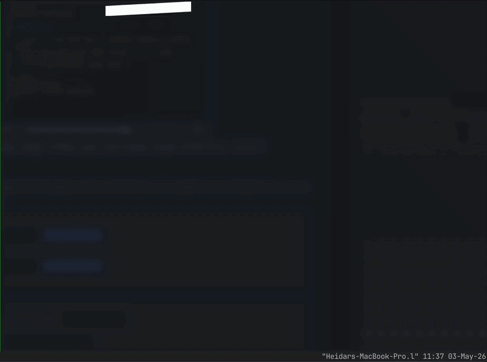

<div align="center">

<h1>
  
</h1>

<p><strong>A micro-IDE in your terminal.</strong></p>

<p>
Navia is a fast, keyboard-driven micro-IDE for developers who live in the
terminal, but still want navigation, preview, search, editing, and git review
in one clean workspace.
</p>

<p>
  <a href="https://github.com/heidaraliy/navia/releases">
    
  </a>
  <a href="https://github.com/heidaraliy/navia/blob/main/LICENSE">
    
  </a>
  <a href="https://go.dev/">
    
  </a>
  
  
</p>

<p>
  
</p>

</div>

---

## Table of Contents

- [Why Navia Exists](#why-navia-exists)
- [Features](#features)
- [Install](#install)
- [Usage](#usage)
- [Keybindings](#keybindings)
- [Configuration](#configuration)
- [Development](#development)
- [Releases](#releases)
- [Contributing](#contributing)
- [License](#license)

## Why Navia Exists

The terminal is powerful, but project navigation is still weirdly fragmented —
at least for someone who was taught to program almost entirely in VS Code.

As LLM tools like Claude Code and Codex became a bigger part of my workflow, I
started living in the terminal more. Eventually, the back-and-forth between my
editor, shell, file browser, search tools, and git commands became annoying.

Jumping from `cd` to `ls` to `find` to `grep` to `nvim` to `git diff` works,
but it is not exactly what I would call fun. It feels like starting with a 6mm
socket and trying every size until one finally fits.

Navia gives you one focused surface for the stuff you do constantly inside a
codebase:

- move around the tree
- preview files without opening them
- search file names and file contents
- make quick edits
- review diffs
- stage, commit, and push changes
- safely move, rename, copy, paste, and delete files

It is definitely *not* trying to replace your editor or shell.

It *is* trying to make the space between them way cleaner.

## Features

| Feature | What it does |
| --- | --- |
| **Project cockpit** | Navigate a persistent project tree with fast keyboard movement, expandable directories, drill-in roots, filters, and a live preview pane. |
| **Rich previews** | Preview directories, text files, source files, images, and binary metadata without opening a separate tool. |
| **Recursive search** | Search file names or file contents from inside the TUI, or launch directly into either search mode. |
| **Built-in modal editor** | Make quick edits with vim-style modes, motions, tabs, undo/redo, search, substitution, Markdown checkbox toggles, and save/quit commands. |
| **External editor handoff** | Open the active buffer in your configured editor with `:nvim` when a change deserves the real blade. |
| **Lightweight LSP** | Use `gopls` for Go definition and reference jumps when LSP support is enabled. |
| **Git review mode** | Review diffs, stage/unstage files, restore/remove changes, commit, push, and refresh from one interface. |
| **Safe file operations** | Create, rename, copy, cut, paste, and safe-delete files. Safe delete moves files to Navia trash by default. |
| **Configurable defaults** | Tune hidden files, ignored names, preview limits, editor choice, safe delete, sorting, theme, and LSP settings. |

### Project Navigation

Navia gives you a persistent project tree with fast keyboard movement,
expandable directories, drill-in roots, hidden-file filtering, ignored-name
filtering, and a preview pane that follows your selection.

Use it as a lightweight file navigator, a project browser, or a quick way to
understand a repo you just opened.

### Rich Previews

Directories show useful summaries. Text files show readable previews. Source
files get Chroma syntax highlighting. Binary files are detected instead of
dumped into your terminal like garbage.

Navia also shows file size, modified time, image metadata, and truncates large
previews so your terminal stays responsive.

### Recursive Search

Search by file name or by text content directly inside the TUI.

You can also launch straight into search mode:

```bash
navia -s "search text"
navia -f "file name"
```

### Built-In Modal Editor

Navia includes a modal editor for quick edits without leaving the workspace.

It supports tabs, dirty-state tracking, vim-style normal/insert/visual modes,
counts, motions, yank/delete/paste, undo/redo, search, substitution, save/quit
commands, jump history, and Markdown task-checkbox toggles.

For bigger edits, use your actual editor:

```vim
:nvim
```

By default, Navia resolves your editor from `$VISUAL`, then `$EDITOR`, then
`nvim`.

### Lightweight Code Intelligence

Navia currently ships with lightweight Go LSP support through `gopls`.

LSP features:

- jump to definition with `gd`
- find references with `gr`
- jump backward/forward through editor history

The goal is not to become a bloated IDE in terminal cosplay. The goal is just
to make common navigation and review loops faster.

### Git Review Mode

Navia has a built-in git review surface for the normal loop:

- see repo status
- preview formatted diffs
- stage and unstage files
- restore or remove changed files
- commit
- push
- refresh automatically

Launch directly into diff mode:

```bash
navia -d
```

Review a patch without checking out another worktree:

```bash
gh pr diff 123 --patch | navia --patch - --patch-label "PR #123"
```

### Safe File Operations

Navia supports create, rename, copy, cut, paste, and delete.

Safe delete is enabled by default. Deleted files are moved into Navia trash
instead of being immediately destroyed.

## Install

You do not need Go to run Navia.

Install the latest release:

```bash
curl -fsSL https://raw.githubusercontent.com/heidaraliy/navia/main/install.sh | sh
```

Or install with Homebrew:

```bash
brew install heidaraliy/tap/navia
```

Manual install is also supported. Download the archive for your platform from
the latest GitHub release, extract it, and put the `navia` binary somewhere on
your `PATH`.

Example for Apple Silicon Macs:

```bash
tar -xzf navia_0.1.0_darwin_arm64.tar.gz
mkdir -p ~/.local/bin
install -m 0755 navia_0.1.0_darwin_arm64/navia ~/.local/bin/navia
navia --version
```

Use the matching archive for your system:

- `darwin_arm64` for Apple Silicon Macs
- `darwin_amd64` for Intel Macs
- `linux_amd64` for most Linux PCs
- `linux_arm64` for ARM Linux machines
- `windows_amd64` for most Windows PCs
- `windows_arm64` for ARM Windows machines

### Windows

1. Download `navia_0.1.0_windows_amd64.zip`, or the ARM archive if needed.
2. Extract the zip.
3. Move `navia.exe` to a directory on your `PATH`.
4. Run this in PowerShell:

```powershell
navia --version
```

SHA-256 checksums are attached to each tagged release.

## Install From Source

Source installs require Go 1.22 or newer.

Install the latest tagged Go module release:

```bash
go install github.com/heidaraliy/navia/cmd/navia@latest
```

Install a specific tagged release:

```bash
go install github.com/heidaraliy/navia/cmd/navia@v0.1.0
```

Run from source:

```bash
git clone https://github.com/heidaraliy/navia.git
cd navia
go run ./cmd/navia
```

Build from source:

```bash
go build ./cmd/navia
```

## Usage

```bash
navia
navia /path/to/project
navia -d
gh pr diff 123 --patch | navia --patch - --patch-label "PR #123"
navia -s "search text"
navia -f "file name"
navia --version
```

| Command | Description |
| --- | --- |
| `navia` | Open the current directory. |
| `navia /path/to/project` | Open a specific directory. |
| `navia -d` | Start in git diff mode. |
| `navia --patch file.diff` | Start in read-only patch review mode. |
| `navia --patch -` | Read a patch from stdin and review it. |
| `navia --patch - --patch-label "PR #123"` | Give a streamed patch a display label. |
| `navia -s "query"` | Start in recursive text search. |
| `navia -f "query"` | Start in recursive file-name search. |
| `navia --version` | Print the installed version. |

## Keybindings

Press `?` inside Navia for the full in-app key reference.

<details>
<summary><strong>Tree mode</strong></summary>

| Key | Action |
| --- | --- |
| `j` / `k` or arrow keys | Move through entries. |
| `enter` / `l` | Expand directories or open search results. |
| `h` / `backspace` | Collapse or jump to the parent. |
| `L` / `shift+enter` | Make the selected directory the root. |
| `/` | Search recursively from the current directory. |
| `tab` | Toggle file-name and text search while searching. |
| `g` | Go to a path. |
| `n` / `N` | Create a file or directory. |
| `r` | Rename. |
| `y`, `x`, `p` | Copy, cut, and paste. |
| `d` | Safe delete. |
| `e` / `c` | Open the selected file in the Navia editor. |
| `D` | Open git diff mode. |
| `?` | Help. |
| `q` | Quit. |

</details>

<details>
<summary><strong>Diff mode</strong></summary>

| Key | Action |
| --- | --- |
| `s` / `u` | Stage or unstage the selected file. |
| `R` / `D` | Restore or remove the selected file. |
| `c` / `p` | Commit or push the current branch. |
| `r` | Refresh manually. |
| `esc` | Return to the tree. |

Patch review mode uses the same navigation and diff preview surface, but it is
read-only because it is reviewing a patch stream instead of a working tree.

</details>

<details>
<summary><strong>Editor mode</strong></summary>

| Key | Action |
| --- | --- |
| `i`, `a`, `I`, `A`, `o`, `O` | Enter insert mode. |
| `h`, `j`, `k`, `l`, `w`, `b`, `e` | Move the cursor. |
| `gg`, `G`, `:number` | Jump by file position. |
| `space` | Toggle the current Markdown task checkbox. |
| `v` / `V` | Visual or visual-line selection. |
| `y`, `d`, `c`, `p` | Yank, delete, change, and paste. |
| `u` / `ctrl+r` | Undo and redo. |
| `/`, `n`, `N` | Search inside the open buffer. |
| `gd` / `gr` | Jump to definition or references when LSP is available. |
| `ctrl+o` / `ctrl+i` | Jump backward or forward through editor history. |
| `:w`, `:q`, `:wq`, `:qa` | Save and close commands. |
| `:e path` | Open another file in a tab. |
| `:bn` / `:bp`, `gt` / `gT` | Move between editor tabs. |
| `:theme` | List themes. |
| `:theme navia` | Switch to the Navia syntax theme. |
| `:nvim` | Open the active buffer in your configured external editor. |
| `ctrl+w h`, `ctrl+w l`, `ctrl+w o` | Focus panes or use editor-only view. |

</details>

## Configuration

Navia reads config from:

```text
~/.config/navia/config.toml
```

Or, when `XDG_CONFIG_HOME` is set:

```text
$XDG_CONFIG_HOME/navia/config.toml
```

Example config:

```toml
show_hidden = false
editor = "nvim"
safe_delete = true
sort_dirs_first = true
preview_max_bytes = 262144
editor_max_bytes = 1048576
enable_lsp = true
gopls_command = "gopls"
theme = "navia"
ignore_names = ".git,node_modules,.next,dist,build,target,.cache"
```

Safe delete is enabled by default.

Deleted files are moved to:

```text
$XDG_DATA_HOME/navia/trash
```

Or, when `XDG_DATA_HOME` is not set:

```text
~/.local/share/navia/trash
```

## Development

```bash
go test ./...
go run ./cmd/navia
go build ./cmd/navia
```

Run this before committing Go changes:

```bash
go fmt ./...
```

## Releases

Maintainers publish releases by pushing a `v*` tag, such as:

```bash
v0.1.0
```

The release workflow runs formatting checks, `go vet ./...`, `go test ./...`,
builds supported desktop archives, writes checksums, and creates the GitHub
release.

See [docs/releasing.md](docs/releasing.md) for the release checklist.

## Contributing

See [CONTRIBUTING.md](CONTRIBUTING.md) for contributor workflow and
[AGENTS.md](AGENTS.md) for agent-specific orchestration.

Keep changes small, tested, and explicit about filesystem safety.

Navia touches real files. Correctness matters.

## License

MIT
